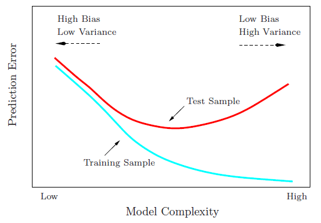
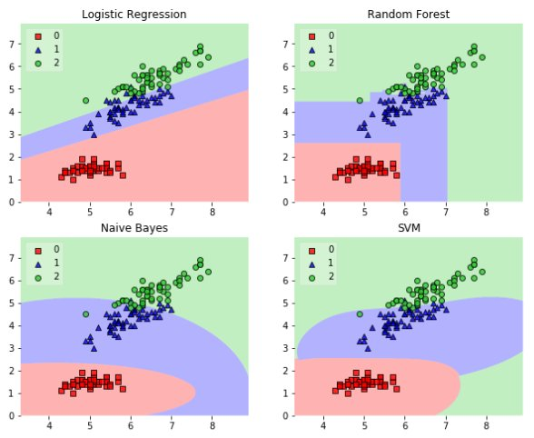
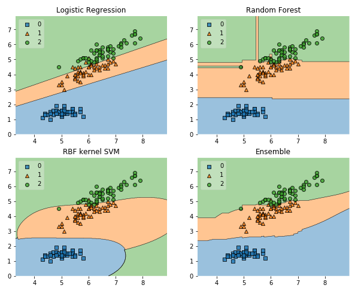

# Machine Learning

The next unit of this class will cover machine learning. But first, let's discuss the difference between Machine Learning and Artificial Intelligence (AI).

## What is machine learning? What is AI?

What is machine learning?

* **ML:** Allowing computers to learn for themselves without being explicitly programmed
    * **USPS:** Computers read handwritten addresses and sort mail accordingly
    * **Google:** AlphaGo, AlphaZero (computers that are world-class chess, go players)
    * **Apple/Amazon/Microsoft:** Siri, Alexa, Cortana voice assistants can understand human speech
    * **Facebook:** automatically finds faces in a photo and tags them to the corresponding user
* In each of the above examples, the machine is "learning" to do something only humans had previously been able to do
* Put differently, the machine was not programmed to read numbers or recognize voices -- it was given a bunch of examples of numbers and human voices and came up with a way to predict what's a number or a voice and what isn't

What is AI?

* **AI:** Constructing machines (robots, computers) to think and act like human beings

Thus, machine learning is a (large) subset of AI

## Machine learning's role in data science

* In data science, machine learning closely resembles statistics.
* Why? Because a lot of data science is about finding "insights" or "policies" in your data that can be used to increase profits or improve quality of life in some other dimension.
* Finding "insights" is about finding correlative and causal relationships among variables
* Statistics is the science that has the vast majority of these tools

## Machine learning vs. econometrics

* **Machine Learning** is all about maximizing and out-of-sample prediction
* **Econometrics** is all about finding "consistent" parameter estimates (e.g. making sure that the estimated parameters of the model will converge to their "true" values given a large enough sample size)
* **Machine Learning** is all about finding y&#770;
* **Econometrics** is all about finding &beta;&#770;

## The fundamental objective of Machine Learning
The fundamental objective is to maximize out-of-sample fit

* But how is this possible given that -- by definition -- we don't see what's not in our sample?
* The solution is to choose functions that predict well in-sample, but penalize them from being too complex.
* **Regularization** is the tool by which in-sample fit is penalized. That is, regularization prevents overly complex functions from being chosen by the algorithm
* **Overfitting** is when we put too much emphasis on in-sample fit, leading us to make poor out-of-sample fit

## Elements of Machine Learning
The following are the basic elements of machine learning in data science:

1. Loss function (this is how one measures how well a particular algorithm predicts in- or out-of-sample)
2. Algorithm (a way to generate prediction rules in-sample that can generate to out-of-sample)
3. Training data (the sample on which the algorithm estimates)
4. Validation data (the sample on which algorithm tuning occurs)
5. Test data (the "out-of-sample" data which is used to measure predictive power on unseen cases)

The algorithm typically comes with **tuning parameters** which are ways to regularize the in-sample fit

**Cross-validation** is how tuning parameters are tuned.

## Example
* Suppose you want to predict housing prices (this is the "hello world" of machine learning)
* You have a large number of relevant variables
* What would you do?
    * You would want to have a model that can detect non-linear relationships (like the USPS handwriting reader)
    * You would also want to have a model that you can tractably estimate
    * And a model that will predict well out-of-sample

### One option: a separate dummy variable for every house
* In this scneario, you run `lm(log(price) ~ as.factor(houseID))`
* What you get is a separate price prediction for every single house
* But what to do when given a new house that's not in the sample?
    * Which house in the sample is the one you should use for prediction?
* The resulting prediction will have horrible out-of-sample fit, even though it has perfect in-sample fit
* This is a classic case of **overfitting**
* We say that this prediciton has **high variance** (i.e. the algorithm thinks random noise is something that is important to the model)

### Another option: house price is a linear function of square footage
* In this scenario, you simple run `lm(log(price) ~ sqft)`
* When given a new hosue with a given square footage, you will only look at the square footage to predict the price of the new house
* This algorithm will result in **underfitting** because the functional form and features it uses for prediction is too simplistic
* We say that this prediction has **high bias** (i.e. the algorithm does not think enough variation is important to the model)

## Bias-variance tradeoff
The **bias-variance tradeoff** refers to the fact that we need to find a model that is complex enough to generalize to new datasets, but is simple enough that it doesn't "hallucinate" random noise as being important

The way to optimally trade off bias and variance is via **regularization**

The following graphic from p. 194 of Hastie, Tsibshirani, and Friedman's *Elements of Statistical Learning* illustrates this tradeoff:

## Regularization methods

1. Regression models (OLS or logistic)
    * L0 (Subset selection): penalize objective function by sum of the parameters &ne;0
    * L1 (LASSO): penalize objective function by sum of absolute value of parameters
    * L2 (Ridge): penalize objective function by sum of square of parameters 
    * Elastic net: penalize by a weighted sum of L1 and L2
2. Tree models
    * Depth, number of leaves, minimal leaf size, other criteria
3. Random forests
    * Number of trees, complexity of each tree, other criteria
4. Nearest neighbors
    * Number of neighbors
5. Neural networks
    * Number of layers, number of neurons per layer, connectivity between neurons (i.e. via L1/L2 regularization)
6. Support Vector Machine
    * L1/L2 regularization
7. Naive bayes
    * Naturally geared towards not overfitting, but can be regularized with iterative variable selection algorithms (similar to stepwise/stagewise regression)

## Visualization of different predictors
The following graphic shows a visualization of different classification algorithms, accross two features (call them X and Y). Note the stark differences in the prediction regions.

Source: [this tweet](https://twitter.com/rasbt/status/974115063308091392?s=12)

## Combined predictors
Often you can get a better prediction by combining multiple sets of prediction. We call these **combined predictors**. 

You can think of the combined predictor as a "committee of experts." Each "expert" votes on the outcome and votes are aggregated in such a way that the resulting prediction ends up being better than any individual component prediction.

3 types of combined predictors (cf. Mullainathan & Spiess, 2017):

1. Bagging (unweighted average of predictors from bootstrap draws)
2. Boosting (linear combination of predictions of a residual)
3. Ensemble (weighted combination of different predictors)

Combined predictors are regularized in the number of draws, number of iterations, or structure of the weights.

## Visualization of combined predictors
The following graphic shows a similar visualization as above, but now incorporates an ensemble prediction region. This provides some solid intuition for why ensemble predictors usually perform better than the predictions from any one algorithm.

Source: [The `mlxtend` GitHub repository](https://github.com/rasbt/mlxtend)

## Cross validation
How do we decide what level of complexity our algorithm should be, especially when we can't see out-of-sample?

The answer is we choose values of the **tuning parameters** that maximize out-of-sample prediction

for example:

* the &lambda; that comes in front of L1, L2, and elastic net regularization
* the maximum depth of the tree or the min. number of observations within each leaf
* etc.

## Splitting the sample
To peform cross-validation, one needs to split the sample. There are differing opinions on this:

Camp A ("Holdout")

1. Training data (~70%)
2. Test ("holdout") data (~30%)

Camp B ("Cross-validation")

1. Training data (~60%)
2. Validation data (~15%)
3. Test data (~25%)

Sample is split randomly, **or** randomly according to how it was generated (e.g. if it's panel data, sample *units*, not observations)

It is ideal to follow the "Cross-validation" camp, but in cases where you don't have many observations (training examples), you may have to go the "Holdout" route.

## How to estimate common Machine Learning algorithms in R

# Helpful links
* [Mullainathan & Spiess (2017)](https://www.aeaweb.org/articles?id=10.1257/jep.31.2.87&within%5Btitle%5D=on&within%5Babstract%5D=on&within%5Bauthor%5D=on&journal=3&q=mullainathan&from=j)
